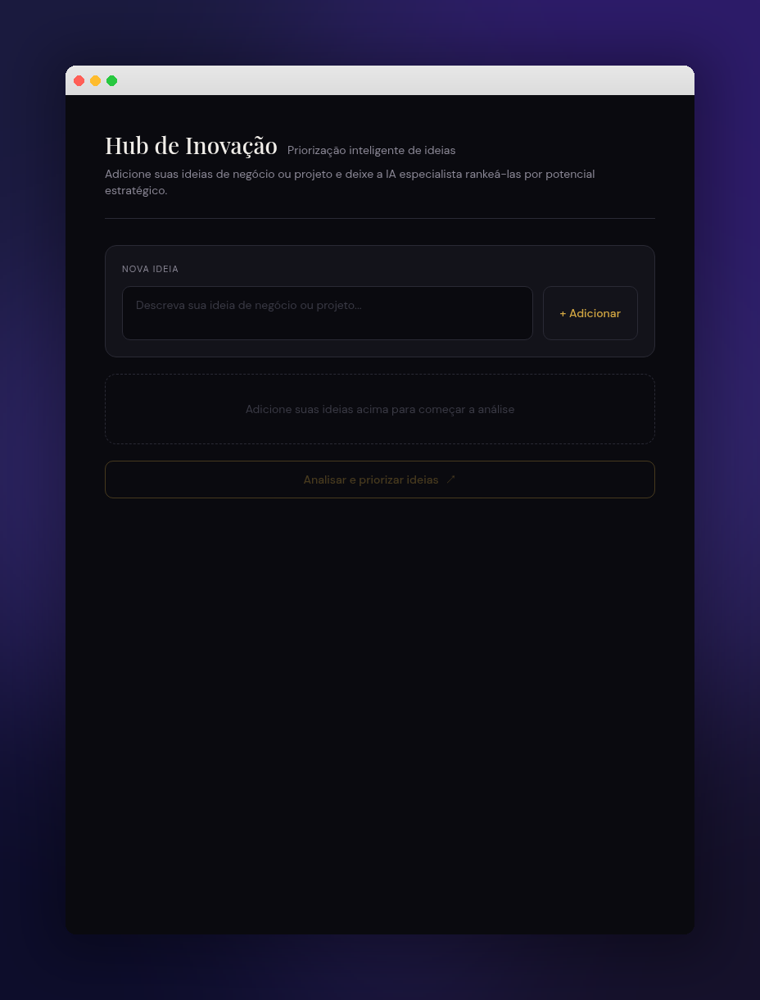

# Hub de Inovação

Aplicativo leve para captura, análise e priorização estratégica de ideias de inovação. Usando IA, o Hub avalia cada ideia em quatro dimensões — **Mercado**, **Viabilidade**, **Inovação** e **Urgência** — gerando um ranking ponderado e um plano de ação em fases para acelerar a execução.

## ✨ Funcionalidades

- 📝 Cadastro rápido de ideias
- 🤖 Análise automatizada via IA
- 📊 Ranking com score ponderado e métricas detalhadas
- 🗺️ Plano de ação dividido em fases (curto, médio e longo prazo)
- 🎨 Interface moderna, responsiva e acessível

## 📸 Screenshot



## 🚀 Instalação

Pré-requisitos: **Node.js 18+** e **npm** (ou bun).

```bash
# 1. Clone o repositório
git clone <url-do-repositorio>
cd hub-de-inovacao

# 2. Instale as dependências
npm install

# 3. Inicie o servidor de desenvolvimento
npm run dev
```

O app ficará disponível em `http://localhost:5173`.

## 🔑 Configuração de Variáveis de Ambiente

Crie um arquivo `.env` na raiz do projeto com a seguinte variável:

```env
VITE_ANTHROPIC_API_KEY=sua_chave_anthropic_aqui
```

### Como obter a chave

1. Acesse [console.anthropic.com](https://console.anthropic.com/)
2. Faça login ou crie uma conta
3. Vá em **API Keys** → **Create Key**
4. Copie a chave gerada e cole no arquivo `.env`

> ⚠️ **Nunca** faça commit do arquivo `.env` — ele já está listado no `.gitignore`.

## 🏗️ Build de Produção

```bash
npm run build
npm run start
```

## 🛠️ Stack Técnica

- **TanStack Start** + **React 19**
- **Vite 7**
- **Tailwind CSS v4**
- **shadcn/ui**
- **TypeScript** (strict)

## 📄 Licença

MIT
